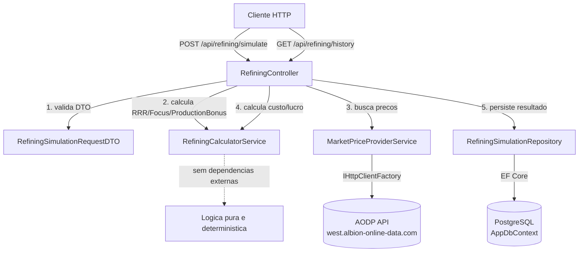
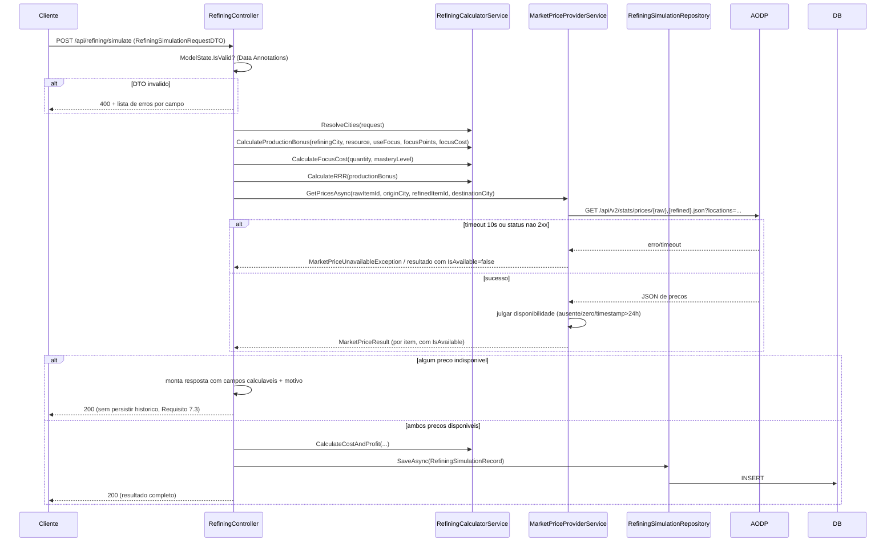

# Documento de Design — Módulo de Refino (Refining Module)

## Overview

O Módulo de Refino adiciona ao AlbionWebApp a capacidade de simular operações de refino do Albion Online, calculando a Resource Return Rate (RRR) efetiva, o custo em Focus Points, e o custo/lucro estimado com base em preços reais de mercado obtidos via Albion Online Data Project (AODP). O módulo segue rigorosamente o padrão arquitetural já estabelecido pelo `SearchItemsController`/`SearchItemsService`: um Controller fino que orquestra Services injetados via DI, com DTOs anotados por Data Annotations para validação de entrada.

A decisão arquitetural central — já indicada no `requirements.md` e no steering `albion-domain-context.md` — é a **separação estrita entre cálculo determinístico e integração de rede**:

- **`RefiningCalculatorService`**: função pura (sem I/O), implementa as fórmulas de RRR, Focus Cost, Production Bonus e cálculo de custo/lucro. Testável exaustivamente com Property-Based Testing (PBT), sem mocks, sem rede, sem banco.
- **`MarketPriceProviderService`**: componente de integração, estende o padrão do `SearchItemsService`, consulta a AODP via `IHttpClientFactory` e aplica a lógica pura de "julgamento de disponibilidade de preço" (ausente/zero/desatualizado).
- **`RefiningSimulationRepository`**: componente de persistência EF Core, grava e consulta o histórico de simulações no PostgreSQL.
- **`RefiningController`**: orquestra os três componentes acima e traduz o resultado para os contratos HTTP do Requisito 6.

Esta separação permite que a lógica de negócio mais crítica (as fórmulas de refino) seja validada por testes de propriedade determinísticos e rápidos, enquanto a integração com serviços externos é validada por testes de integração com HTTP mockado.

## Architecture



### Fluxo da simulação (POST /api/refining/simulate)



## Components and Interfaces

### 1. `RefiningCalculatorService` (lógica pura, sem I/O)

Namespace: `AlbionWebApp.Services`

Responsável exclusivamente pelas fórmulas dos Requisitos 1, 2, 4 e 5 (cálculo de cidades/Production Bonus/RRR/custo/lucro). Não recebe `IHttpClientFactory` nem `AppDbContext`. Todos os métodos são determinísticos e sem efeitos colaterais — candidatos ideais a PBT.

```csharp
public interface IRefiningCalculatorService
{
    // Requisito 5: resolve as 3 cidades a partir da cidade base e dos overrides opcionais
    ResolvedCities ResolveCities(AlbionCityEnum baseCity, AlbionCityEnum? originCity,
        AlbionCityEnum? refiningCity, AlbionCityEnum? destinationCity);

    // Requisito 1 (Criterios 2,3,4,5): calcula o Production Bonus total em pontos percentuais
    ProductionBonusResult CalculateProductionBonus(AlbionCityEnum refiningCity, RefinedResourceEnum resource,
        bool useFocus, int focusPointsAvailable, int focusCost);

    // Requisito 2 (Criterios 2,3): calcula o custo em Focus Points, reduzido pela maestria
    int CalculateFocusCost(int rawQuantity, int masteryLevel);

    // Requisito 1 (Criterio 6): RRR = 1 - 1/(1 + bonus/100)
    decimal CalculateRRR(int productionBonusPercentagePoints);

    // Requisito 1 (Criterio 7): quantidade devolvida = quantidade bruta * RRR
    decimal CalculateReturnedQuantity(int rawQuantity, decimal rrr);

    // Requisito 4: custo total, receita liquida, lucros e comparacao
    CostAndProfitResult CalculateCostAndProfit(CostAndProfitInput input);

    // Requisitos 1.8, 1.9, 1.10, 2.1, 8.*: validacao de dominio (alem das Data Annotations do DTO)
    IReadOnlyList<ValidationError> Validate(RefiningSimulationRequestDTO request);
}
```

Tipos de suporte (records imutáveis, todos em `AlbionWebApp.Models` ou como tipos internos do Service):

```csharp
public record ResolvedCities(AlbionCityEnum OriginCity, AlbionCityEnum RefiningCity, AlbionCityEnum DestinationCity);

public record ProductionBonusResult(
    int TotalPercentagePoints,
    int BasePercentagePoints,          // 18 ou 58
    bool FocusBonusApplied,             // true se +59pp foi somado
    bool FocusInsufficientWarning);     // true se useFocus=true mas focus insuficiente

public record CostAndProfitInput(
    int RawQuantity, decimal ReturnedQuantity, decimal RawItemPrice, decimal RefinedItemPrice,
    decimal? StationFeeFixed, decimal? StationFeePercentage, decimal? MarketTaxPercentage);

public record CostAndProfitResult(
    decimal TotalRefiningCost, decimal NetRefiningRevenue, decimal EstimatedRefiningProfit,
    decimal EstimatedRawSaleProfit, RefiningRecommendationEnum MoreProfitableOption);

public record ValidationError(string Field, string Message);
```

**Mapeamento fixo de especialização de cidade → recurso** (Requisito 1, Critérios 2 e 3; fonte: steering, seção 2.4): implementado como uma tabela estática somente-leitura (`Dictionary<AlbionCityEnum, RefinedResourceEnum?>`) dentro do `RefiningCalculatorService` ou em uma classe estática `CityResourceSpecializationMap`:

| Cidade | Recurso especializado |
|---|---|
| Martlock | Hide |
| Bridgewatch | Stone |
| Lymhurst | Fiber |
| FortSterling | Wood |
| Thetford | Ore |
| Caerleon | (nenhum) |
| Brecilien | (nenhum) |

### 2. `MarketPriceProviderService` (integração com AODP)

Namespace: `AlbionWebApp.Services`

Estende o padrão do `SearchItemsService` existente: recebe `IHttpClientFactory`, monta a URL da AODP e faz o parse do JSON de resposta. Adiciona timeout explícito de 10s (Requisito 3, Critério 3) e a lógica de julgamento de disponibilidade (Critério 4), que é **extraída como método puro e testável isoladamente** (não depende de rede, apenas do objeto de preço já desserializado).

```csharp
public interface IMarketPriceProviderService
{
    // Requisito 3.1, 3.2: combina bruto e refinado em uma unica chamada HTTP
    Task<MarketPriceQueryResult> GetPricesAsync(
        string rawItemId, AlbionCityEnum originCity,
        string refinedItemId, AlbionCityEnum destinationCity,
        CancellationToken cancellationToken = default);
}

// Logica pura, extraida para ser testavel sem rede (Requisito 3, Criterio 4)
public static class MarketPriceAvailabilityJudge
{
    public static bool IsAvailable(decimal? sellPriceMin, DateTime? lastUpdated, DateTime now);
}

public record MarketPriceQueryResult(
    MarketPriceQuote RawItemPrice, MarketPriceQuote RefinedItemPrice, bool CommunicationFailed, string? FailureReason);

public record MarketPriceQuote(string ItemId, AlbionCityEnum City, decimal? Price, DateTime? LastUpdated, bool IsAvailable);
```

Detalhes de implementação:
- Timeout de 10s aplicado via `CancellationTokenSource(TimeSpan.FromSeconds(10))` combinado com o token externo, **não** via `HttpClient.Timeout` global (para não afetar outras chamadas do mesmo `HttpClient` compartilhado pela factory).
- Falha de comunicação (timeout ou status HTTP não 2xx) é sinalizada via `CommunicationFailed = true` e propagada como resultado tipado — não como exceção não tratada — para permitir que o Controller monte a resposta HTTP 200 parcial do Requisito 6.4, conforme decisão de design descrita em "Error Handling".
- A combinação de dois itens em uma única chamada usa o formato já documentado no steering: `GET /api/v2/stats/prices/{rawItemId},{refinedItemId}.json?locations={originCity},{destinationCity}`. O provider filtra, para cada item, apenas a cotação da cidade relevante (origem para o bruto, destino para o refinado) e seleciona o menor `sell_price_min` maior que zero.

### 3. `RefiningSimulationRepository` (persistência EF Core)

Namespace: `AlbionWebApp.Data` (ou `AlbionWebApp.Repositories`, seguindo convenção a definir — ver "Design Decisions").

```csharp
public interface IRefiningSimulationRepository
{
    // Requisito 7.1, 7.2
    Task<RefiningSimulationRecord> SaveAsync(RefiningSimulationRecord record, CancellationToken cancellationToken = default);

    // Requisito 7.4: paginacao por identificador de jogador, ordenado por CreatedAtUtc desc
    Task<IReadOnlyList<RefiningSimulationRecord>> GetHistoryAsync(string playerId, int page, int pageSize = 50,
        CancellationToken cancellationToken = default);
}
```

### 4. `RefiningController`

Namespace: `AlbionWebApp.Controllers`

```csharp
[ApiController]
[Route("api/refining")]
public class RefiningController : ControllerBase
{
    // POST api/refining/simulate
    [HttpPost("simulate")]
    public async Task<ActionResult<RefiningSimulationResponseDTO>> SimulateAsync(
        [FromBody] RefiningSimulationRequestDTO request);

    // GET api/refining/history?playerId={id}&page={n}
    [HttpGet("history")]
    public async Task<ActionResult<IReadOnlyList<RefiningSimulationResponseDTO>>> GetHistoryAsync(
        [FromQuery] string playerId, [FromQuery] int page = 1);
}
```

Responsabilidades do Controller (fino, sem lógica de cálculo):
1. Deixa o model binding + Data Annotations validarem o DTO (`ModelState.IsValid` → 400 automático via `[ApiController]`, que já produz `ValidationProblemDetails` com erros por campo — atende Requisito 6.2 nativamente).
2. Executa validações de domínio adicionais via `RefiningCalculatorService.Validate` (regras que Data Annotations não expressam bem, ex.: combinação Resource+Tier, cidade especializada) e retorna 400 com a mesma estrutura de erros por campo se falhar.
3. Chama `ResolveCities`, `CalculateFocusCost`, `CalculateProductionBonus`, `CalculateRRR`, `CalculateReturnedQuantity` (sempre disponíveis, sem rede).
4. Chama `MarketPriceProviderService.GetPricesAsync`.
5. Se `CommunicationFailed` ou algum preço `IsAvailable == false`: monta `RefiningSimulationResponseDTO` com `MarketDataAvailable = false`, `MarketDataFailureReason` preenchido, campos de custo/lucro nulos, **não chama o Repository** (Requisito 7.3), retorna 200.
6. Caso contrário: chama `CalculateCostAndProfit`, monta o registro `RefiningSimulationRecord`, chama `Repository.SaveAsync`, retorna 200 com resultado completo.

## Data Models

### Enums novos

`AlbionWebApp/Enums/RefinedResourceEnum.cs`:

```csharp
public enum RefinedResourceEnum
{
    Fiber = 1,
    Hide = 2,
    Ore = 3,
    Stone = 4,
    Wood = 5
}
```

`AlbionWebApp/Enums/RefiningRecommendationEnum.cs`:

```csharp
public enum RefiningRecommendationEnum
{
    Refine = 1,
    SellRaw = 2,
    Equal = 3
}
```

O mapeamento cidade→recurso especializado (Requisito 1) **não** é modelado como enum, pois é uma relação N:1 estática entre dois enums já existentes — é implementado como tabela estática (`IReadOnlyDictionary<AlbionCityEnum, RefinedResourceEnum?>`) dentro da camada de Services, evitando duplicar informação de domínio em um terceiro enum.

O mapeamento `RefinedResourceEnum` → item IDs da AODP por tier (ex.: `T4_FIBER` / `T4_CLOTH`) é resolvido por uma função utilitária pura `ItemIdResolver.Resolve(RefinedResourceEnum resource, int tier, bool refined)`, já que os IDs seguem o padrão `T{tier}_{RESOURCE}` / `T{tier}_{PRODUCT}` do jogo (ex.: Fiber→Cloth, Hide→Leather, Ore→"METALBAR", Stone→"STONEBLOCK", Wood→"PLANKS"). Essa função é pura e testável junto ao `RefiningCalculatorService`.

### Entidade EF Core: `RefiningSimulationRecord`

`AlbionWebApp/Models/RefiningSimulationRecord.cs`:

```csharp
public class RefiningSimulationRecord
{
    public Guid Id { get; set; }
    public string PlayerId { get; set; } = string.Empty;

    // Parametros de entrada (Requisitos 1, 2, 5)
    public RefinedResourceEnum Resource { get; set; }
    public int ResourceTier { get; set; }
    public int MasteryLevel { get; set; }
    public int FocusPointsAvailable { get; set; }
    public int FocusCostRequested { get; set; }
    public bool UseFocusRequested { get; set; }
    public int RawQuantity { get; set; }
    public AlbionCityEnum OriginCity { get; set; }
    public AlbionCityEnum RefiningCity { get; set; }
    public AlbionCityEnum DestinationCity { get; set; }
    public decimal? StationFeeFixed { get; set; }
    public decimal? StationFeePercentage { get; set; }
    public decimal? MarketTaxPercentage { get; set; }

    // Resultados calculados (Requisito 6.3)
    public int ProductionBonusPercentagePoints { get; set; }
    public decimal Rrr { get; set; }
    public int FocusCostCalculated { get; set; }
    public bool FocusBonusApplied { get; set; }
    public decimal TotalRefiningCost { get; set; }
    public decimal NetRefiningRevenue { get; set; }
    public decimal EstimatedRefiningProfit { get; set; }
    public decimal EstimatedRawSaleProfit { get; set; }
    public RefiningRecommendationEnum MoreProfitableOption { get; set; }

    public DateTime CreatedAtUtc { get; set; }
}
```

Regras de mapeamento (`OnModelCreating` do `AppDbContext`):
- `Id` como chave primária, `Guid`, gerado no servidor (`ValueGeneratedOnAdd`).
- Índice composto em `(PlayerId, CreatedAtUtc DESC)` para suportar a consulta paginada do Requisito 7.4 eficientemente.
- Enums mapeados como `int` (padrão do EF Core, consistente com os enums existentes do projeto).
- Campos monetários (`decimal`) com precisão explícita `decimal(18,4)` (prata do Albion pode ter valores altos; 4 casas decimais cobrem percentuais intermediários dos cálculos).
- `CreatedAtUtc` com valor default gerado na aplicação (não no banco), explicitamente como `DateTime.UtcNow` com `DateTimeKind.Utc`, para atender ao Requisito 7.2 de forma verificável em teste sem depender do clock do banco.

`AppDbContext` ganha:

```csharp
public DbSet<RefiningSimulationRecord> RefiningSimulationRecords { get; set; }
```

### Migration

Uma migration EF Core (`AddRefiningSimulationRecords`) deve ser criada via `dotnet ef migrations add AddRefiningSimulationRecords` após a implementação da entidade, criando a tabela `RefiningSimulationRecords` no PostgreSQL com o índice composto mencionado. A migration é gerada na fase de implementação (tasks), não neste documento de design.

### DTOs

`AlbionWebApp/DTOs/RefiningSimulationRequestDTO.cs` (Data Annotations cobrindo Requisito 8):

```csharp
public class RefiningSimulationRequestDTO
{
    [Required(ErrorMessage = "Identificador de jogador é obrigatório.")]
    public string PlayerId { get; set; } = string.Empty;

    [Required(ErrorMessage = "Recurso é obrigatório.")]
    [EnumDataType(typeof(RefinedResourceEnum), ErrorMessage = "Recurso inválido. Recursos suportados: Fiber, Hide, Ore, Stone, Wood.")]
    public RefinedResourceEnum Resource { get; set; }

    [Range(2, 8, ErrorMessage = "Tier inválido. Intervalo suportado: T2 a T8.")]
    public int ResourceTier { get; set; }

    [Range(0, 100, ErrorMessage = "Mastery_Level deve estar entre 0 e 100.")]
    public int MasteryLevel { get; set; }

    [Range(0, int.MaxValue, ErrorMessage = "Focus_Points deve ser zero ou positivo.")]
    public int FocusPointsAvailable { get; set; }

    public bool UseFocus { get; set; }

    [Range(1, 999999, ErrorMessage = "Quantidade deve ser um número positivo até 999999.")]
    public int RawQuantity { get; set; }

    [Required(ErrorMessage = "Cidade base é obrigatória.")]
    [EnumDataType(typeof(AlbionCityEnum), ErrorMessage = "Cidade inválida.")]
    public AlbionCityEnum City { get; set; }

    [EnumDataType(typeof(AlbionCityEnum), ErrorMessage = "Cidade de origem inválida.")]
    public AlbionCityEnum? OriginCity { get; set; }

    [EnumDataType(typeof(AlbionCityEnum), ErrorMessage = "Cidade de refino inválida.")]
    public AlbionCityEnum? RefiningCity { get; set; }

    [EnumDataType(typeof(AlbionCityEnum), ErrorMessage = "Cidade de destino inválida.")]
    public AlbionCityEnum? DestinationCity { get; set; }

    [Range(0, double.MaxValue, ErrorMessage = "Station_Fee deve ser zero ou positivo.")]
    public decimal? StationFeeFixed { get; set; }

    [Range(0, 100, ErrorMessage = "Station_Fee percentual deve estar entre 0 e 100.")]
    public decimal? StationFeePercentage { get; set; }

    [Range(0, 100, ErrorMessage = "Market_Tax deve estar entre 0 e 100 por cento.")]
    public decimal? MarketTaxPercentage { get; set; }
}
```

Nota de design: `StationFeeFixed` e `StationFeePercentage` são mutuamente exclusivos por natureza (Requisito 4.2 vs 4.3); essa regra de "no máximo um dos dois informado" é validada em `RefiningCalculatorService.Validate` (validação de domínio cross-field), pois `[Range]` não expressa exclusividade entre campos.

`AlbionWebApp/DTOs/RefiningSimulationResponseDTO.cs`:

```csharp
public class RefiningSimulationResponseDTO
{
    public int ProductionBonusPercentagePoints { get; set; }
    public decimal Rrr { get; set; }
    public int FocusCostCalculated { get; set; }
    public bool FocusBonusApplied { get; set; }
    public bool FocusInsufficientWarning { get; set; }

    public bool MarketDataAvailable { get; set; }
    public string? MarketDataFailureReason { get; set; }

    public decimal? TotalRefiningCost { get; set; }
    public decimal? NetRefiningRevenue { get; set; }
    public decimal? EstimatedRefiningProfit { get; set; }
    public decimal? EstimatedRawSaleProfit { get; set; }
    public RefiningRecommendationEnum? MoreProfitableOption { get; set; }
}
```

`AlbionWebApp/DTOs/RefiningHistoryQueryDTO.cs` (query string do Requisito 7.4):

```csharp
public class RefiningHistoryQueryDTO
{
    [Required(ErrorMessage = "Identificador de jogador é obrigatório.")]
    public string PlayerId { get; set; } = string.Empty;

    [Range(1, int.MaxValue, ErrorMessage = "Página deve ser maior ou igual a 1.")]
    public int Page { get; set; } = 1;
}
```

## Pesquisa de mercado: fórmula de Focus Cost (não oficial)

A wiki oficial (steering, seção 2.6) confirma a **direção** da relação entre maestria e custo de Focus (mais especialização → menos Focus necessário, até um teto de 6.25% do custo base), mas não publica uma fórmula fechada de "Mastery_Level (0-100) → Focus Cost". Para preencher essa lacuna, pesquisei ferramentas de terceiros já existentes na comunidade — incluindo as listadas como "3rd party tools" no próprio site oficial da AODP (albion-online-data.com) — para entender como elas resolvem esse cálculo.

### Fontes encontradas

- **[refinestation.com](https://refinestation.com/)** — calculadora de refino ativa, confirma textualmente: *"iSpecs reduce focus cost. They do not change return rate."* Reforça a mesma direção já conhecida pela wiki, sem publicar a fórmula interna.
- **[Edison-Cabrera/AO-Refining-App](https://github.com/Edison-Cabrera/AO-Refining-App)** (GitHub, código aberto, fonte não oficial/comunitária) — único recurso encontrado que publica uma fórmula explícita e uma tabela de custo base:

  ```
  FocusCost = BaseCost × (FocusCostEfficiency / 10000) ^ 0.5

  totalMastery = (specsT4 + specsT5 + specsT6 + specsT7 + specsT8) × 30
  specificTierSpecs = specsDoTierEspecifico × 250
  FocusCostEfficiency = totalMastery + specificTierSpecs
  ```

  Com `BaseCost` (custo de Focus por unidade, antes de eficiência) tabelado por tier e qualidade:

  | Tier | Common | Uncommon | Rare | Exceptional |
  |---|---|---|---|---|
  | T4 | 48 | 89 | 143 | 239 |
  | T5 | 89 | 160 | 269 | 461 |
  | T6 | 160 | 284 | 487 | 844 |
  | T7 | 284 | 500 | 866 | 1508 |
  | T8 | 500 | 877 | 1527 | 2666 |

  O mesmo repositório também documenta que, a partir de T4, o refino consome **material refinado do tier anterior além do recurso bruto do tier atual** (ex.: refinar T5 exige 3 unidades de recurso bruto T5 + 1 unidade de material refinado T4) — mecânica que **não está modelada no Requisito 4 nem no `CalculateCostAndProfit` atual deste design**, e que fica registrada aqui como gap conhecido, não incorporada nesta fase (ver "Limitações conhecidas" abaixo).

- **[Brannstroom/albiononline-refining-calculator](https://github.com/Brannstroom/albiononline-refining-calculator)** — calculadora web funcional, mas o próprio autor descreve o código como "kitchen sink full of bad practises and technical debt" e não documenta a fórmula interna de Focus Cost publicamente — descartada como fonte de fórmula, mantida apenas como referência de produto similar.

### Por que a fórmula do Edison-Cabrera não foi adotada literalmente

Com expoente `0.5` (raiz quadrada), no teto oficial de eficiência (40.000, conforme a wiki), `FocusCost = BaseCost × (40000/10000)^0.5 = BaseCost × 2` — ou seja, o custo **dobraria** no nível máximo de maestria, o que contradiz diretamente a wiki oficial (custo cai para 6.25% do base no máximo). Isso sugere uma inversão de fórmula (talvez seja um divisor no código-fonte real, não um multiplicador) ou uma leitura incorreta da wiki por parte do autor do repositório. Por ser uma fonte não oficial e sem verificação cruzada disponível, **não é adotada literalmente** — apenas sua estrutura geral (eficiência cresce com pontos de especialização, com um divisor de normalização) inspira a fórmula aproximada abaixo.

### Fórmula aproximada adotada para este módulo (não oficial, decisão de design)

Para respeitar a Property 6 (Focus_Cost nunca aumenta quando Mastery_Level aumenta) e o teto de 6.25% citado pela wiki oficial, adota-se a seguinte fórmula aproximada, mapeando `Mastery_Level` (0-100, conforme definido no requirements.md) linearmente para o intervalo de eficiência \[0, 40000\] da wiki:

```
efficiencyRatio = MasteryLevel / 100                     // 0.0 a 1.0
focusCostMultiplier = 1 - (efficiencyRatio × 0.9375)     // 1.0 (sem maestria) a 0.0625 (maestria maxima)
FocusCost = BaseFocusCostPerUnit × RawQuantity × focusCostMultiplier
```

Onde `BaseFocusCostPerUnit` é uma constante por `(Resource, ResourceTier)` a ser definida na implementação (pode reaproveitar a tabela de custo base do Edison-Cabrera como ponto de partida, já que é a única tabela numérica disponível, mesmo sendo de fonte não oficial).

Esta fórmula:
- Garante `FocusCost(MasteryLevel=0) = BaseFocusCostPerUnit × RawQuantity` (custo cheio)
- Garante `FocusCost(MasteryLevel=100) = BaseFocusCostPerUnit × RawQuantity × 0.0625` (6.25% do base, alinhado à wiki oficial)
- É estritamente não crescente em `MasteryLevel` (Property 6 satisfeita por construção, sem depender de arredondamento)

**Esta fórmula deve ser tratada como uma aproximação de gameplay para fins de simulação, não como uma réplica exata do cálculo interno do jogo.** Deve ser documentada como tal via XML doc comment no método `CalculateFocusCost` durante a implementação (tasks), citando este documento como referência.

### Limitações conhecidas (não corrigidas nesta fase)

- O consumo de material refinado do tier anterior (T4+) identificado na pesquisa não está incorporado ao `CalculateCostAndProfit`; o cálculo atual assume apenas recurso bruto → recurso refinado em uma única etapa. Correção proposta para uma iteração futura do módulo, fora do escopo do MVP definido no requirements.md.
- O `BaseFocusCostPerUnit` por tier/qualidade não tem fonte oficial confirmada; valores de terceiros (tabela do Edison-Cabrera) podem ser usados como estimativa inicial na implementação, mas devem ser tratados como configuráveis (não hardcoded sem possibilidade de ajuste), dado o baixo grau de confiança da fonte.

## Design Decisions

- **Por que separar `RefiningCalculatorService` de `MarketPriceProviderService`**: garante que ~90% da lógica de negócio (fórmulas do jogo) seja testável com PBT em milissegundos, sem flakiness de rede. Alinhado explicitamente com a seção 3 do steering `albion-domain-context.md`.
- **Por que não reaproveitar `SearchItemsService` diretamente**: `SearchItemsService` hoje é acoplado a uma única cidade fixa (`Caerleon`) e não implementa timeout nem combinação de múltiplos itens/cidades. `MarketPriceProviderService` é um novo serviço que segue o mesmo padrão (`IHttpClientFactory`, mesma URL base), mas generalizado. Reaproveitar via herança/composição do `SearchItemsService` existente não traz benefício e acoplaria o módulo de Refino aos parâmetros fixos do módulo de Search; os dois serviços permanecem independentes, ambos seguindo o mesmo padrão arquitetural.
- **Erros de rede como resultado tipado, não exceção**: evita que o Controller precise de `try/catch` para um fluxo de negócio esperado (Requisito 6.4 é um "caminho feliz" de resposta 200, não uma condição excepcional).
- **Falha de mercado não persiste histórico**: decisão explícita para atender ao Requisito 7.3 combinado com 6.4 — uma simulação sem dados de mercado ainda retorna 200 (não é uma "falha" da simulação em si, os campos calculáveis são retornados), mas por não ter produzido um resultado completo de custo/lucro, não é elegível para persistência, conforme Glossário (`Refining_Simulation` "elegível para persistência").
- **Localização do Repository**: colocado em `AlbionWebApp/Data/` junto ao `AppDbContext`, mantendo simetria com a estrutura de pastas atual do projeto (que ainda não tem uma pasta `Repositories/`); pode ser revisitado se o projeto adotar padrão Repository mais amplamente no futuro.
- **Precisão decimal**: todos os valores monetários e percentuais calculados usam `decimal` (nunca `double`/`float`), pelo padrão já estabelecido implicitamente pelo domínio financeiro do módulo, evitando erros de arredondamento acumulados nas fórmulas de RRR/lucro.

## Correctness Properties

*A property is a characteristic or behavior that should hold true across all valid executions of a system-essentially, a formal statement about what the system should do. Properties serve as the bridge between human-readable specifications and machine-verifiable correctness guarantees.*

As propriedades abaixo cobrem exclusivamente a lógica pura e determinística do `RefiningCalculatorService`, `MarketPriceAvailabilityJudge` e `RefiningSimulationRepository` (paginação), conforme identificado no prework. Comportamentos de integração com a AODP (Requisito 3, Critérios 1–3) e wiring HTTP puro (Requisito 6, Critérios 1, 3, 4) são cobertos por testes de integração/exemplo, não por PBT — ver "Testing Strategy".

### Property 1: Bônus base de Production Bonus depende exclusivamente da especialização cidade/recurso

Para qualquer cidade Royal e qualquer recurso suportado, o Production_Bonus base calculado é 58 pontos percentuais se, e somente se, o mapeamento fixo de especialização associa aquela cidade àquele recurso; caso contrário é 18 pontos percentuais.

**Validates: Requirements 1.2, 1.3**

### Property 2: Bônus de Focus é aplicado se e somente se o Focus disponível for suficiente

Para qualquer combinação de indicador de uso de Focus, Focus_Points disponíveis e Focus_Cost: se o indicador é verdadeiro e Focus_Points >= Focus_Cost, o Production_Bonus resultante inclui exatamente +59 pontos percentuais adicionais e os Focus_Points remanescentes são iguais a (Focus_Points - Focus_Cost); se o indicador é verdadeiro e Focus_Points < Focus_Cost, o Production_Bonus não inclui o bônus de Focus e o resultado sinaliza insuficiência; se o indicador é falso, nenhum Focus é consumido e nenhum bônus de Focus é aplicado.

**Validates: Requirements 1.4, 1.5, 2.3, 2.4, 2.5, 2.6**

### Property 3: RRR está sempre no intervalo [0, 1) e segue a fórmula definida

Para qualquer Production_Bonus maior ou igual a zero, a RRR calculada é igual a `1 - 1/(1 + Production_Bonus/100)`, é sempre maior ou igual a 0, e é sempre estritamente menor que 1.

**Validates: Requirements 1.6**

### Property 4: Quantidade devolvida nunca excede a quantidade bruta informada

Para qualquer quantidade bruta positiva e qualquer RRR válida (no intervalo [0,1) garantido pela Property 3), a quantidade devolvida calculada (quantidade bruta × RRR) é sempre menor que a quantidade bruta informada e nunca negativa.

**Validates: Requirements 1.7**

### Property 5: Validação de faixa rejeita entradas fora dos limites de domínio

Para qualquer combinação de Resource_Tier fora de [2,8], Refined_Resource fora do conjunto suportado, quantidade bruta <= 0, ou Mastery_Level fora de [0,100], a validação do `RefiningCalculatorService` rejeita a simulação com pelo menos um erro identificando o campo inválido; para qualquer combinação de valores dentro desses limites, a validação não rejeita por esses critérios.

**Validates: Requirements 1.8, 1.9, 1.10, 2.1**

### Property 6: Focus_Cost nunca aumenta quando o Mastery_Level aumenta

Para qualquer quantidade bruta fixa e qualquer par de níveis de maestria (M1, M2) onde M1 < M2, o Focus_Cost calculado para M2 é sempre menor ou igual ao Focus_Cost calculado para M1.

**Validates: Requirements 2.2**

### Property 7: Julgamento de disponibilidade de preço é consistente com ausência, zero e desatualização

Para qualquer preço e qualquer timestamp de última atualização: o preço é julgado indisponível se, e somente se, o preço estiver ausente (nulo), for igual a zero, ou a diferença entre o instante atual e o timestamp exceder 24 horas; em qualquer outra combinação de valores, o preço é julgado disponível.

**Validates: Requirements 3.4**

### Property 8: Indisponibilidade de qualquer preço impede o cálculo de custo/lucro

Para qualquer par de julgamentos de disponibilidade (preço do bruto, preço do refinado), se pelo menos um dos dois for indisponível, o resultado da simulação indica explicitamente que custo/lucro não puderam ser calculados por ausência de dados de mercado; se ambos forem disponíveis, o resultado contém valores calculados de custo e lucro.

**Validates: Requirements 3.5**

### Property 9: Receita bruta é sempre proporcional à quantidade e ao preço unitário

Para qualquer quantidade não negativa e qualquer preço unitário não negativo, a receita bruta calculada (venda do bruto sem refinar ou venda do refinado) é sempre igual ao produto exato entre a quantidade e o preço unitário.

**Validates: Requirements 4.4, 4.7**

### Property 10: Custo de aquisição é proporcional à quantidade líquida necessária

Para qualquer quantidade bruta, quantidade devolvida (sempre menor que a bruta, pela Property 4) e preço do recurso bruto na origem, o custo de aquisição calculado é igual ao produto entre (quantidade bruta − quantidade devolvida) e o preço, e é sempre não negativo.

**Validates: Requirements 4.1**

### Property 11: Station_Fee contribui integralmente ao custo total, no modo correspondente ao informado

Para qualquer custo de aquisição e qualquer Station_Fee informado como valor fixo, o custo total de refino inclui exatamente esse valor fixo somado ao custo de aquisição; para qualquer Station_Fee informado como percentual, o custo total de refino inclui exatamente o percentual aplicado sobre o custo de aquisição somado a ele; quando nenhum Station_Fee é informado, o custo total é igual ao custo de aquisição.

**Validates: Requirements 4.2, 4.3**

### Property 12: Market_Tax reduz a receita bruta proporcionalmente, nunca a torna negativa

Para qualquer receita bruta não negativa e qualquer Market_Tax no intervalo [0,100], a receita líquida resultante da dedução do Market_Tax é sempre igual à receita bruta multiplicada por (1 − Market_Tax/100), é sempre menor ou igual à receita bruta original, e nunca é negativa.

**Validates: Requirements 4.5, 4.8**

### Property 13: Lucro é sempre consistente com receita e custo

Para qualquer receita líquida de refino e qualquer custo total de refino, o lucro estimado de refinar calculado é sempre igual exatamente à diferença entre a receita líquida e o custo total (podendo ser negativo).

**Validates: Requirements 4.6**

### Property 14: A recomendação de opção mais lucrativa é sempre consistente com a comparação matemática dos lucros

Para qualquer par de valores de lucro estimado (refinar, vender bruto), a recomendação retornada indica "refinar" se e somente se o lucro de refinar for estritamente maior; indica "vender bruto" se e somente se o lucro de vender bruto for estritamente maior; indica "igual" se e somente se os dois lucros forem exatamente iguais.

**Validates: Requirements 4.9**

### Property 15: Resolução de cidades aplica o valor padrão apenas aos campos não informados

Para qualquer cidade base e qualquer combinação de overrides opcionais de Origin_City, Refining_City e Destination_City (cada um podendo estar presente ou ausente independentemente), cada cidade resolvida é igual ao override correspondente quando ele foi informado, e igual à cidade base quando o override correspondente estiver ausente.

**Validates: Requirements 5.2, 5.3**

### Property 16: Production Bonus depende exclusivamente da Refining_City

Para qualquer par de simulações que compartilham a mesma Refining_City, o mesmo recurso, e os mesmos parâmetros de Focus, mas diferem em Origin_City e/ou Destination_City, o Production_Bonus calculado é idêntico entre as duas simulações.

**Validates: Requirements 5.5**

### Property 17: Cidade fora do conjunto de cidades Royal válidas é sempre rejeitada

Para qualquer valor de Origin_City, Refining_City ou Destination_City que não corresponda a um valor definido do enum `AlbionCityEnum`, a validação rejeita a simulação identificando o campo de cidade inválido; para qualquer valor que corresponda a um valor válido do enum, a validação não rejeita por esse critério.

**Validates: Requirements 5.4**

### Property 18: Validação de campos numéricos rejeita valores fora da faixa aceita, para qualquer campo

Para qualquer valor de quantidade bruta <= 0, Mastery_Level fora de [0,100], Focus_Points negativo, Station_Fee (fixo) negativo, Market_Tax fora de [0,100], ou Station_Fee percentual fora de [0,100], a validação rejeita a simulação com um erro que identifica o campo específico e a faixa aceita; para qualquer combinação de valores dentro dessas faixas, a validação não rejeita por esses critérios.

**Validates: Requirements 8.1, 8.2, 8.3, 8.4, 8.5, 8.6**

### Property 19: Persistir e recuperar uma simulação preserva os dados e o carimbo de tempo em UTC

Para qualquer `RefiningSimulationRecord` válido, salvá-lo no repositório e em seguida recuperá-lo pelo identificador de jogador retorna um registro com todos os parâmetros de entrada e resultados calculados idênticos aos salvos, e com `CreatedAtUtc.Kind` igual a `DateTimeKind.Utc`.

**Validates: Requirements 7.1, 7.2**

### Property 20: Paginação do histórico nunca excede o tamanho de página e respeita a ordenação decrescente

Para qualquer conjunto de N registros de simulação associados a um identificador de jogador (incluindo N = 0), qualquer página solicitada contém no máximo 50 registros, os registros retornados estão ordenados por `CreatedAtUtc` em ordem decrescente, e quando N = 0 a página retornada é uma lista vazia.

**Validates: Requirements 7.4**

## Error Handling

| Cenário | Camada | Tratamento |
|---|---|---|
| DTO com campo obrigatório ausente ou fora de faixa (Data Annotations) | `RefiningController` (model binding) | ASP.NET Core `[ApiController]` retorna automaticamente 400 com `ValidationProblemDetails` contendo erros por campo — atende Requisito 6.2 sem código adicional no Controller. |
| Regra de domínio cross-field (ex.: Station_Fee fixo e percentual ambos informados, cidade especializada) | `RefiningCalculatorService.Validate` | Controller verifica a lista de `ValidationError` retornada; se não vazia, monta manualmente um 400 com a mesma forma de `ValidationProblemDetails` (um erro por campo). |
| Timeout de 10s na chamada à AODP | `MarketPriceProviderService` | `CancellationTokenSource` interno cancela a chamada; exceção de cancelamento é capturada internamente e traduzida em `MarketPriceQueryResult { CommunicationFailed = true, FailureReason = "timeout" }` — nunca propaga uma exceção não tratada ao Controller (Requisito 3.3: "sem interromper o processo de forma silenciosa" é atendido retornando um resultado explícito, não relançando). |
| Status HTTP não 2xx da AODP | `MarketPriceProviderService` | Mesma forma acima, com `FailureReason` descrevendo o status HTTP recebido. |
| Preço ausente/zero/desatualizado (>24h) | `MarketPriceAvailabilityJudge` (função pura) | Marca `MarketPriceQuote.IsAvailable = false`; não é um erro de exceção, é um estado de dado válido a ser tratado pelo Controller. |
| Falha de comunicação ou preço indisponível chegando ao Controller | `RefiningController` | Monta `RefiningSimulationResponseDTO` com `MarketDataAvailable = false` e `MarketDataFailureReason` preenchido; retorna 200 (não 4xx/5xx, pois a simulação parcial é uma resposta válida por design — Requisito 6.4); **não** persiste histórico (Requisito 7.3). |
| Falha inesperada de banco de dados ao persistir (`DbUpdateException`, conexão indisponível) | `RefiningController` / `RefiningSimulationRepository` | Não coberto explicitamente pelos requisitos funcionais; tratado como erro 500 padrão do pipeline ASP.NET Core (sem handler customizado nesta fase) — a simulação calculada ainda é retornada ao cliente antes da tentativa de persistência ser conhecida como falha, portanto esse caso prioriza notificar a falha de persistência sem quebrar a resposta já montada. Este comportamento deve ser revisitado caso o produto exija garantias mais fortes de consistência. |

## Testing Strategy

O módulo combina Property-Based Testing (PBT) para a lógica pura com testes de integração/exemplo para os componentes com I/O, conforme a separação arquitetural adotada.

### Testes de propriedade (PBT)

- **Biblioteca**: [FsCheck](https://fscheck.github.io/FsCheck/) (via `FsCheck.Xunit`), padrão estabelecido para PBT em .NET/C#. Não será implementada geração de dados aleatórios "do zero".
- **Configuração**: cada propriedade é implementada como um único teste, decorado com `[Property(MaxTest = 100)]` no mínimo (100 iterações), executando contra `IRefiningCalculatorService`, `MarketPriceAvailabilityJudge` e `IRefiningSimulationRepository` (este último contra um banco de teste, ver abaixo).
- **Tag obrigatória**: cada teste de propriedade deve conter um comentário no formato `// Feature: refining-module, Property {number}: {property_text}` imediatamente acima do método de teste, referenciando a propriedade correspondente deste documento.
- **Geradores customizados**: geradores FsCheck para `AlbionCityEnum`, `RefinedResourceEnum`, e para tipos de entrada compostos (ex.: `RefiningSimulationRequestDTO` válido) devem ser definidos para reduzir ruído de valores inválidos triviais quando a propriedade não é sobre validação (Properties 1–4, 6, 9–16 assumem entrada válida; Properties 5, 17, 18 exercitam deliberadamente o espaço de entradas inválidas).
- **Property 19 (round-trip de persistência)**: por envolver EF Core, é executada contra um provedor PostgreSQL de teste (ou o provedor InMemory/SQLite do EF Core configurado para os testes) em vez de contra mocks — é a única propriedade que roda com I/O real de banco, mantida com 100 iterações por ser de baixo custo (operação local/containerizada).
- **Property 20 (paginação)**: pode ser testada tanto contra o banco de teste (mesma infraestrutura da Property 19) quanto, alternativamente, extraindo a lógica de paginação/ordenação para um método puro sobre `IEnumerable<RefiningSimulationRecord>` que é então testado sem banco — recomendação de design é extrair essa lógica pura sempre que possível para reduzir custo de execução dos testes.

### Testes de integração/exemplo (sem PBT)

Aplicáveis aos itens classificados como INTEGRATION/EXAMPLE/SMOKE no prework:

- **`MarketPriceProviderService` contra AODP**: `HttpClient` mockado (via `HttpMessageHandler` fake ou biblioteca como `RichardSzalay.MockHttp`), com 1-3 exemplos representativos por cenário:
  - Resposta de sucesso com ambos os itens presentes → combina em uma única chamada HTTP (verificar `handler` foi chamado exatamente 1 vez).
  - Timeout simulado (delay maior que 10s) → `CommunicationFailed = true`, `FailureReason` contém "timeout".
  - Status HTTP 500/404 → `CommunicationFailed = true`.
  - JSON com preço ausente para um dos itens → item correspondente com `IsAvailable = false`.
- **`RefiningController.SimulateAsync`**: testes de integração via `WebApplicationFactory<Program>` (ou testes de Controller isolados com serviços mockados via DI):
  - Payload válido completo → 200 com todos os campos do Requisito 6.3 presentes na resposta serializada.
  - Payload inválido (ex.: `ResourceTier = 99`) → 400 com lista de erros contendo o campo `ResourceTier`.
  - `MarketPriceProviderService` mockado retornando falha de comunicação → 200 com `MarketDataAvailable = false` e verificação de que `Repository.SaveAsync` **não** foi chamado.
  - `MarketPriceProviderService` mockado retornando preço indisponível para um item → mesmo comportamento acima.
- **`RefiningController.GetHistoryAsync`**: exemplo simples — jogador sem histórico retorna lista vazia com 200 (não 404).

### Testes unitários (exemplos pontuais, complementares às propriedades)

- Casos de borda explícitos mencionados no requirements.md que servem como documentação viva além da cobertura já garantida pelos geradores de PBT (ex.: Resource_Tier exatamente 2 e exatamente 8 são aceitos; Resource_Tier 1 e 9 são rejeitados; Focus_Cost == Focus_Points é tratado como suficiente, não insuficiente — limite exato do Requisito 2.5).
- Mensagens de erro específicas por campo (verificação textual pontual, já que Property 18 verifica apenas a presença do erro por campo, não o texto exato da mensagem).
